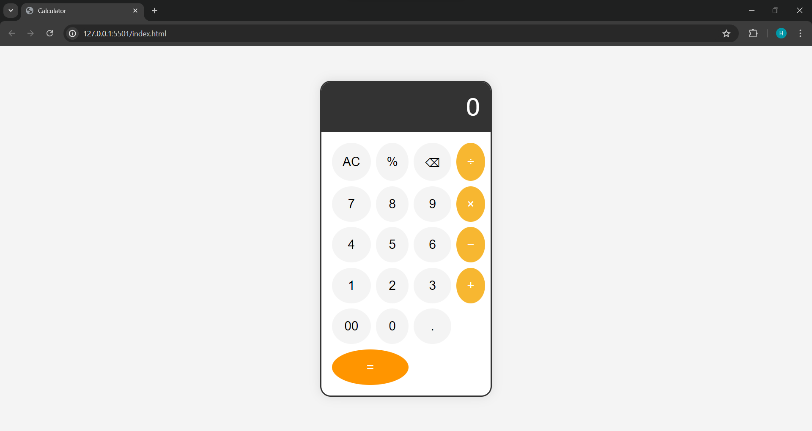

# Calculator Project

A simple calculator application built using HTML, CSS, and JavaScript. This project demonstrates basic web development skills and provides a functional calculator that can perform basic arithmetic operations.

## Features

- Addition, subtraction, multiplication, and division operations
- Clear and delete functionality
- Responsive design for various screen sizes

## Demo

You can view and use the calculator live on GitHub Pages: [Calculator Demo](https://Hitesh9298.github.io/CODSOFT/)

Replace `<username>` with your GitHub username.

## Screenshots




## Installation

To run the calculator locally, follow these steps:

1. **Clone the repository:**
   ```bash
   git clone https://github.com/<username>/codsoft.git
